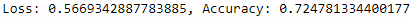
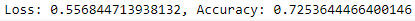

# Neural_Network_Charity_Analysis

## Overview
The purpose of this analysis was to look at historical charity data and see if we could create a neural network that had at least a 75% accuracy.

## Results

### Data Processing
* Target: The target of this model was whether or not the charity was successful.
* Features: The features of this model were Application Type, Affiliation, Classification, Use Case, Organization, Income Amount, Special Considerations, and Ask Amount.
* Removed: We removed EIN (ID number) and Names of the charities.

### Compiling, Training, and Evaluating the Model
#### How many neurons, layers, and activation functions did you select for your neural network model, and why?
* We originally used two layers with 80 and 30 neurons, respectively. We also used Relu for the 2 layers and sigmoid for the output layer. Here are the changes we made for out three optimizaton attempts:
  * First Attempt
    * Third hidden layer with 30 neurons
    * Replaced application counts less than 100 instead of 500
  * Second Attempt
    *	Replaced application counts less than 100 instead of 500
    * Replaced classification counts less than 500 instead of 1,000
    * Dropped ‘SPECIAL_CONSIDERATIONS’ columns
  * Third attempt
    * Decreased epochs to 75
    * Third hidden layer with 40 neurons
 #### Were you able to achieve the target model performance?
 * No we were not. Here are the results below:
 * First Attempt

 * Second Attempt

* Third Attempt

#### What steps did you take to try and increase model performance?
* As stated above, I tried a couple ways to increase the performance of the model and I was not quite able to.

## Summary
I would recommend a Supervised Machine Learning model in the future because we know what the output should and that is whether or not the charity will be successful. Specifically logistic regression because there are only two outcome: successful and unsuccessful.

